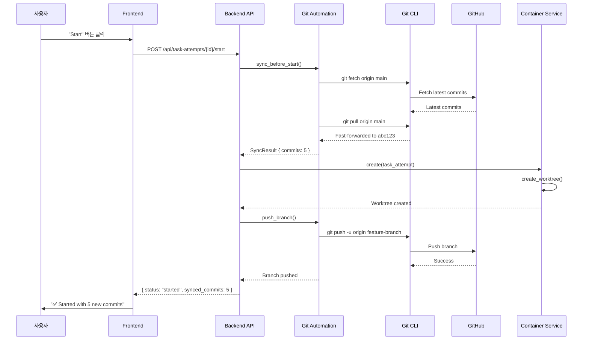
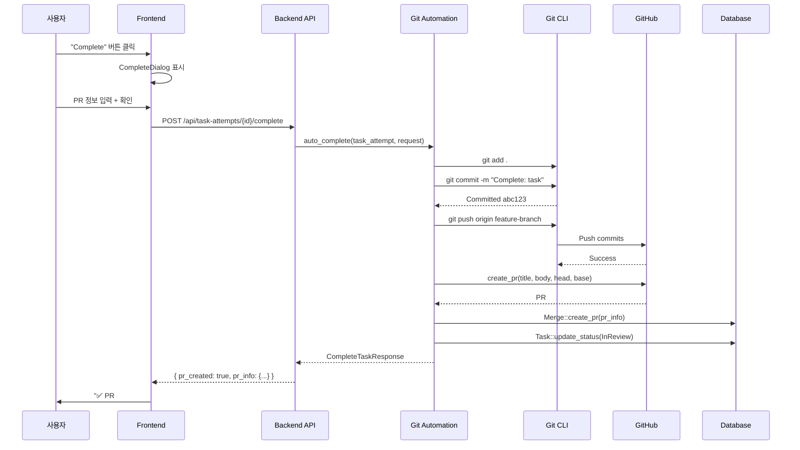
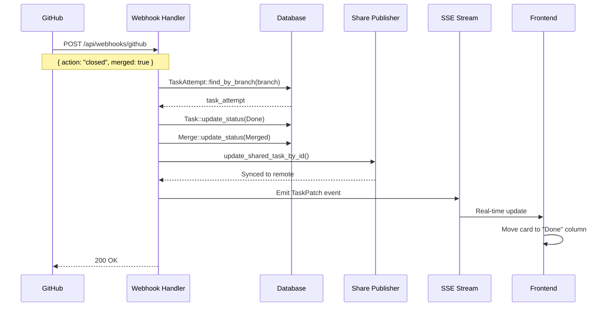

# Zero-Git 자동화 시스템 아키텍처

> **목표:** 사용자가 Git을 전혀 신경쓰지 않고, Anyon 칸반 보드만으로 협업 개발을 완료할 수 있는 시스템

**작성일:** 2025-11-17
**버전:** 1.0
**상태:** 설계 단계

---

## 📋 목차

1. [개요](#1-개요)
2. [현재 아키텍처 분석](#2-현재-아키텍처-분석)
3. [개선된 아키텍처 설계](#3-개선된-아키텍처-설계)
4. [핵심 컴포넌트](#4-핵심-컴포넌트)
5. [데이터 플로우](#5-데이터-플로우)
6. [기술 스펙](#6-기술-스펙)
7. [구현 계획](#7-구현-계획)
8. [보안 고려사항](#8-보안-고려사항)
9. [성능 최적화](#9-성능-최적화)

---

## 1. 개요

### 1.1 문제 정의

**현재 문제점:**
- 팀원들이 서로의 최신 코드를 수동으로 `git pull` 해야 함
- PR 생성, Merge 후 상태 업데이트를 수동으로 해야 함
- Git 명령어를 모르는 사용자는 협업이 어려움
- Setup Script에 `git pull`을 수동으로 넣어야 함

**목표:**
- Git 작업을 100% 자동화
- 칸반 보드에서 "Start" → "Complete" 버튼만으로 전체 워크플로우 완료
- GitHub Webhook 연동으로 실시간 상태 동기화
- 사용자는 태스크 관리에만 집중

### 1.2 핵심 가치 제안

| 기능 | Before (수동) | After (자동) |
|------|--------------|-------------|
| 요구사항 명확화 | 불명확 → 재작업 발생 | 🆕 **AI Plan Stage** ✨ |
| 최신 코드 동기화 | `git pull origin main` | "Start" 버튼 클릭 시 자동 |
| 브랜치 생성 | `git checkout -b feature` | Worktree 생성 시 자동 |
| 코드 커밋 | `git add . && git commit` | AI 완료 시 자동 |
| GitHub Push | `git push origin feature` | "Complete" 버튼 시 자동 |
| PR 생성 | GitHub UI에서 수동 | "Complete" 버튼 시 자동 |
| PR Merge 후 상태 | 수동으로 "Done" 표시 | Webhook으로 자동 |
| **Git 명령어 사용** | **9회** | **0회** ✨ |
| **재작업 발생** | **30%** | **15%** (Plan으로 50% 감소) ✨ |

---

## 2. 현재 아키텍처 분석

### 2.1 현재 시스템 구조

```
┌──────────────────────────────────────────────────────────┐
│                    Frontend (React)                       │
│  - Kanban Board                                          │
│  - Task Cards                                            │
│  - Manual Git Operations                                 │
└──────────────────────────────────────────────────────────┘
                          │ HTTP/SSE
                          ▼
┌──────────────────────────────────────────────────────────┐
│                  Backend (Rust/Axum)                      │
│  ┌────────────┐  ┌────────────┐  ┌────────────┐         │
│  │ Container  │  │ Git Service│  │ GitHub     │         │
│  │ Service    │  │            │  │ Service    │         │
│  └────────────┘  └────────────┘  └────────────┘         │
└──────────────────────────────────────────────────────────┘
                          │
                          ▼
┌──────────────────────────────────────────────────────────┐
│              Local Git Repository                         │
│  - main 브랜치 (옛날 버전일 수 있음)                       │
│  - Worktrees (/tmp/worktrees/task-xxx)                   │
└──────────────────────────────────────────────────────────┘
                          │
                          ▼
                   ┌─────────────┐
                   │   GitHub    │
                   │  (원격 저장소)│
                   └─────────────┘
```

### 2.2 현재 워크플로우 (수동)

```
1. [사용자] Task 생성
2. [사용자] 터미널에서 "git pull origin main"
3. [사용자] Anyon에서 "Start" 클릭
4. [시스템] Worktree 생성 (옛날 main 기준)
5. [AI] 코드 작성
6. [사용자] 터미널에서 "git add . && git commit"
7. [사용자] 터미널에서 "git push"
8. [사용자] GitHub에서 PR 생성
9. [사용자] GitHub에서 PR Merge
10. [사용자] Anyon에서 수동으로 "Done" 표시
```

**문제점:**
- ❌ 2, 6, 7, 8, 10번은 수동 작업
- ❌ Git 명령어를 알아야 함
- ❌ 실수 가능성 높음 (잘못된 브랜치, 충돌 등)

---

## 3. 개선된 아키텍처 설계

### 3.1 Zero-Git 시스템 구조

```
┌──────────────────────────────────────────────────────────┐
│                Frontend (React)                           │
│  ┌─────────────┐  ┌─────────────┐  ┌─────────────┐      │
│  │ Kanban Board│  │ Complete    │  │ Sync Status │      │
│  │             │  │ Dialog      │  │ Indicator   │      │
│  └─────────────┘  └─────────────┘  └─────────────┘      │
└──────────────────────────────────────────────────────────┘
                          │ HTTP/SSE/WebSocket
                          ▼
┌──────────────────────────────────────────────────────────┐
│              Backend (Rust/Axum)                          │
│  ┌────────────────────────────────────────────────────┐  │
│  │           🆕 Git Automation Service                 │  │
│  │  - Auto Sync Manager                              │  │
│  │  - Auto Push Manager                              │  │
│  │  - PR Auto Creator                                │  │
│  │  - Conflict Resolver                              │  │
│  └────────────────────────────────────────────────────┘  │
│  ┌────────────┐  ┌────────────┐  ┌────────────┐         │
│  │ Container  │  │ Git Service│  │ GitHub     │         │
│  │ Service    │  │ (Enhanced) │  │ Service    │         │
│  └────────────┘  └────────────┘  └────────────┘         │
│  ┌────────────────────────────────────────────────────┐  │
│  │           🆕 Webhook Handler                        │  │
│  │  - GitHub PR Events                               │  │
│  │  - Auto Status Sync                               │  │
│  └────────────────────────────────────────────────────┘  │
└──────────────────────────────────────────────────────────┘
         │                                       ▲
         ▼                                       │ Webhook
┌──────────────────┐                    ┌──────────────────┐
│ Local Git Repo   │◄──────────────────►│    GitHub        │
│ (Always Synced)  │    Push/Pull       │  - Repository    │
└──────────────────┘                    │  - PR Events     │
                                        └──────────────────┘
```

### 3.2 개선된 워크플로우 (자동 + Plan Stage)

```
1. [사용자] Task 생성
2. 🆕 [사용자] "Plan" 버튼 클릭
   └─► [AI] Task 분석 및 명확화 질문 생성
   └─► [사용자] 질문에 답변
   └─► [AI] 명확한 요구사항 문서 생성
   └─► [시스템] 상태 → "Planning"
3. [사용자] "Start Development" 버튼 클릭
   └─► [시스템] 자동 git fetch + pull
   └─► [시스템] Worktree 생성 (최신 main 기준)
   └─► [시스템] 브랜치 자동 push (upstream 설정)
   └─► [시스템] 상태 → "In Progress"
4. [AI] 명확화된 요구사항 기반 코드 작성
5. [사용자] "Complete" 버튼 클릭
   └─► [시스템] 자동 커밋
   └─► [시스템] 자동 push
   └─► [시스템] PR 자동 생성
   └─► [시스템] 상태 → "In Review"
6. [사용자] GitHub에서 "Merge" 클릭
   └─► [Webhook] Anyon으로 이벤트 전송
   └─► [시스템] 상태 → "Done" 자동 변경
   └─► [시스템] 팀원들에게 알림

✅ 사용자는 2, 3, 5번만!
✅ Git 명령어 0회!
✅ 재작업 50% 감소 (명확한 요구사항)!
```

> **2025-11-XX 업데이트:** PlanTaskDialog UI, Kanban `planning` 컬럼, TaskPanel 요약 표시, 그리고 `/start-planning`, `/plan-answers`, `/complete-planning` API가 배포되어 위 워크플로우의 Planning 구간이 실제 제품에 반영되었습니다.

---

## 4. 핵심 컴포넌트

### 4.0 🆕 Task Clarification Service

**책임:**
- Task 분석 및 애매한 부분 감지
- AI 기반 명확화 질문 생성
- 사용자 답변 수집 및 저장
- 최종 요구사항 문서 생성

**위치:** `crates/services/src/services/task_clarification.rs` (신규)

**주요 함수:**

```rust
pub struct TaskClarificationService {
    db: DBService,
    executor: Box<dyn Executor>,
}

impl TaskClarificationService {
    /// Task 분석 및 질문 생성
    pub async fn generate_questions(
        &self,
        task: &Task,
    ) -> Result<Vec<ClarificationQuestion>, ClarificationError>;

    /// 사용자 답변 저장
    pub async fn save_answer(
        &self,
        task_id: Uuid,
        question_id: &str,
        answer: &str,
    ) -> Result<(), ClarificationError>;

    /// 최종 요구사항 문서 생성
    pub async fn generate_plan_summary(
        &self,
        task: &Task,
    ) -> Result<String, ClarificationError>;

    /// Plan 완료 여부 확인
    pub async fn is_plan_complete(
        &self,
        task_id: Uuid,
    ) -> Result<bool, ClarificationError>;
}
```

**통합 포인트:**
- **Container Service**: Plan Summary를 AI Executor에 context로 전달
- **Task Model**: `plan_summary` 필드 추가
- **Frontend**: PlanTaskDialog 컴포넌트

### 4.1 Git Automation Service

**책임:**
- Task 시작 전 자동 동기화
- Task 완료 후 자동 push
- PR 자동 생성
- 충돌 자동 감지 및 해결

**위치:** `crates/services/src/services/git_automation.rs` (신규)

**주요 함수:**

```rust
pub struct GitAutomationService {
    git_cli: GitCli,
    github: GitHubService,
    db: DBService,
}

impl GitAutomationService {
    /// Task 시작 전: 최신 코드 자동 동기화
    pub async fn sync_before_start(
        &self,
        project: &Project,
        target_branch: &str,
    ) -> Result<SyncResult, GitAutomationError>;

    /// Task 완료 후: 자동 커밋 + Push + PR 생성
    pub async fn auto_complete(
        &self,
        task_attempt: &TaskAttempt,
        request: AutoCompleteRequest,
    ) -> Result<PullRequestInfo, GitAutomationError>;

    /// 충돌 감지 및 AI에게 해결 요청
    pub async fn resolve_conflicts(
        &self,
        task_attempt: &TaskAttempt,
    ) -> Result<(), GitAutomationError>;

    /// PR 상태 추적 및 자동 업데이트
    pub async fn track_pr_status(
        &self,
        task_attempt_id: Uuid,
    ) -> Result<PrStatus, GitAutomationError>;
}
```

### 4.2 Webhook Handler

**책임:**
- GitHub Webhook 이벤트 수신
- PR 상태 변경 감지 (opened, closed, merged)
- Task 상태 자동 업데이트
- 팀원 알림

**위치:** `crates/server/src/routes/webhooks.rs` (신규)

**이벤트 처리:**

```rust
pub enum GitHubWebhookEvent {
    PullRequestOpened {
        pr_number: i32,
        branch: String,
    },
    PullRequestClosed {
        pr_number: i32,
        branch: String,
        merged: bool,
    },
    PullRequestReviewed {
        pr_number: i32,
        state: ReviewState,
    },
}

pub async fn handle_github_webhook(
    State(deployment): State<DeploymentImpl>,
    Json(payload): Json<GitHubWebhookPayload>,
) -> Result<Json<ApiResponse<()>>, ApiError>;
```

### 4.3 Enhanced Container Service

**기존 `create()` 함수 개선:**

```rust
async fn create(&self, task_attempt: &TaskAttempt)
    -> Result<ContainerRef, ContainerError>
{
    let project = /* ... */;
    let git_automation = GitAutomationService::new(/* ... */);

    // 🆕 1. 자동 동기화
    let sync_result = git_automation
        .sync_before_start(&project, &task_attempt.target_branch)
        .await?;

    tracing::info!(
        "✅ Synced {} commits from remote",
        sync_result.commits_pulled
    );

    // 2. Worktree 생성 (기존)
    WorktreeManager::create_worktree(
        &project.git_repo_path,
        &task_attempt.branch,
        &worktree_path,
        &task_attempt.target_branch,
        true,
    ).await?;

    // 🆕 3. 브랜치 자동 push (upstream 설정)
    git_automation
        .push_branch(&project, &task_attempt.branch)
        .await?;

    Ok(worktree_path.to_string_lossy().to_string())
}
```

### 4.4 Complete Task Endpoint

**새로운 API 엔드포인트:**

**위치:** `crates/server/src/routes/task_attempts.rs`

```rust
#[derive(Deserialize)]
pub struct CompleteTaskRequest {
    pub auto_create_pr: bool,
    pub pr_title: Option<String>,
    pub pr_body: Option<String>,
    pub auto_merge_if_approved: bool,
}

#[derive(Serialize)]
pub struct CompleteTaskResponse {
    pub committed: bool,
    pub pushed: bool,
    pub pr_created: bool,
    pub pr_info: Option<PullRequestInfo>,
    pub task_status: TaskStatus,
}

pub async fn complete_task_attempt(
    State(deployment): State<DeploymentImpl>,
    Extension(task_attempt): Extension<TaskAttempt>,
    Json(request): Json<CompleteTaskRequest>,
) -> Result<Json<ApiResponse<CompleteTaskResponse>>, ApiError>;
```

---

## 5. 데이터 플로우

### 5.1 Task 시작 플로우



### 5.2 Task 완료 플로우



### 5.3 Webhook 플로우 (PR Merge)



---

## 6. 기술 스펙

### 6.1 데이터베이스 스키마 변경

#### 6.1.0 🆕 Task Status 확장

```sql
-- TaskStatus enum에 'planning' 추가
-- Tasks 테이블 확장
ALTER TABLE tasks ADD COLUMN plan_summary TEXT;
ALTER TABLE tasks ADD COLUMN plan_started_at TIMESTAMP;
ALTER TABLE tasks ADD COLUMN plan_completed_at TIMESTAMP;
```

**Rust Enum:**
```rust
#[derive(Debug, Clone, Serialize, Deserialize, TS, PartialEq)]
pub enum TaskStatus {
    #[serde(rename = "todo")]
    Todo,

    #[serde(rename = "planning")]  // 🆕
    Planning,

    #[serde(rename = "inprogress")]
    InProgress,

    #[serde(rename = "inreview")]
    InReview,

    #[serde(rename = "done")]
    Done,
}
```

#### 6.1.0.1 🆕 새로운 테이블: `plan_questions`

```sql
CREATE TABLE plan_questions (
    id TEXT PRIMARY KEY,
    task_id TEXT NOT NULL,
    question_id TEXT NOT NULL,
    question_text TEXT NOT NULL,
    category TEXT NOT NULL,
    required BOOLEAN DEFAULT FALSE,
    suggested_answers TEXT,  -- JSON array
    created_at TIMESTAMP NOT NULL DEFAULT CURRENT_TIMESTAMP,

    FOREIGN KEY (task_id) REFERENCES tasks(id) ON DELETE CASCADE,
    UNIQUE(task_id, question_id)
);

CREATE INDEX idx_plan_questions_task ON plan_questions(task_id);
```

#### 6.1.0.2 🆕 새로운 테이블: `plan_conversations`

```sql
CREATE TABLE plan_conversations (
    id TEXT PRIMARY KEY,
    task_id TEXT NOT NULL,
    question_id TEXT NOT NULL,
    question_text TEXT NOT NULL,
    answer TEXT NOT NULL,
    answered_by TEXT,
    answered_at TIMESTAMP NOT NULL DEFAULT CURRENT_TIMESTAMP,

    FOREIGN KEY (task_id) REFERENCES tasks(id) ON DELETE CASCADE,
    UNIQUE(task_id, question_id)
);

CREATE INDEX idx_plan_conversations_task ON plan_conversations(task_id);
```

#### 6.1.1 새로운 테이블: `git_sync_logs`

```sql
CREATE TABLE git_sync_logs (
    id TEXT PRIMARY KEY,
    task_attempt_id TEXT NOT NULL,
    sync_type TEXT NOT NULL, -- 'pull', 'push', 'pr_create'
    before_commit TEXT,
    after_commit TEXT,
    commits_count INTEGER,
    success BOOLEAN NOT NULL,
    error_message TEXT,
    created_at TIMESTAMP NOT NULL DEFAULT CURRENT_TIMESTAMP,

    FOREIGN KEY (task_attempt_id) REFERENCES task_attempts(id)
);

CREATE INDEX idx_git_sync_logs_task_attempt
    ON git_sync_logs(task_attempt_id);
```

**목적:** Git 동기화 작업 기록 및 디버깅

#### 6.1.2 `task_attempts` 테이블 확장

```sql
ALTER TABLE task_attempts ADD COLUMN auto_synced BOOLEAN DEFAULT FALSE;
ALTER TABLE task_attempts ADD COLUMN auto_pushed BOOLEAN DEFAULT FALSE;
ALTER TABLE task_attempts ADD COLUMN pr_auto_created BOOLEAN DEFAULT FALSE;
ALTER TABLE task_attempts ADD COLUMN last_sync_at TIMESTAMP;
ALTER TABLE task_attempts ADD COLUMN upstream_tracking BOOLEAN DEFAULT FALSE;
```

#### 6.1.3 새로운 테이블: `webhook_events`

```sql
CREATE TABLE webhook_events (
    id TEXT PRIMARY KEY,
    source TEXT NOT NULL, -- 'github', 'gitlab'
    event_type TEXT NOT NULL, -- 'pr_opened', 'pr_merged'
    payload TEXT NOT NULL, -- JSON
    processed BOOLEAN DEFAULT FALSE,
    task_attempt_id TEXT,
    created_at TIMESTAMP NOT NULL DEFAULT CURRENT_TIMESTAMP,
    processed_at TIMESTAMP,

    FOREIGN KEY (task_attempt_id) REFERENCES task_attempts(id)
);

CREATE INDEX idx_webhook_events_processed
    ON webhook_events(processed, created_at);
```

### 6.2 API 엔드포인트

#### 6.2.0 🆕 Plan Stage 엔드포인트

**6.2.0.1 Plan 시작**

```
POST /api/tasks/{id}/start-planning

Request: {}

Response:
{
  "success": true,
  "data": {
    "task_status": "planning",
    "questions": [
      {
        "id": "q1",
        "question": "어떤 인증 방식을 원하시나요?",
        "category": "authentication",
        "required": true,
        "suggested_answers": ["OAuth", "Email/Password", "소셜"]
      }
    ]
  }
}
```

**6.2.0.2 답변 저장**

```
POST /api/tasks/{id}/plan-answers

Request:
{
  "answers": [
    {
      "question_id": "q1",
      "answer": "Google OAuth"
    }
  ]
}

Response:
{
  "success": true,
  "data": {
    "saved_count": 1,
    "is_complete": true,
    "plan_summary": "## 명확화된 요구사항\n..."
  }
}
```

**6.2.0.3 Plan 완료 및 개발 시작**

```
POST /api/tasks/{id}/complete-planning

Request: {}

Response:
{
  "success": true,
  "data": {
    "task_status": "inprogress",
    "plan_summary": "...",
    "sync_info": {
      "synced": true,
      "commits_pulled": 3
    }
  }
}
```

#### 6.2.1 Task 시작 (Enhanced)

```
POST /api/task-attempts/{id}/start

Request:
{
  "executor_profile_id": "claude-sonnet",
  "auto_sync": true  // 🆕 기본값 true
}

Response:
{
  "success": true,
  "data": {
    "execution_process_id": "uuid",
    "sync_info": {  // 🆕
      "synced": true,
      "commits_pulled": 5,
      "before_commit": "abc123",
      "after_commit": "def456"
    }
  }
}
```

#### 6.2.2 Task 완료 (New)

```
POST /api/task-attempts/{id}/complete

Request:
{
  "auto_create_pr": true,
  "pr_title": "feat: Login feature",
  "pr_body": "Implemented OAuth login",
  "auto_merge_if_approved": false
}

Response:
{
  "success": true,
  "data": {
    "committed": true,
    "pushed": true,
    "pr_created": true,
    "pr_info": {
      "number": 123,
      "url": "https://github.com/owner/repo/pull/123",
      "status": "open"
    },
    "task_status": "inreview"
  }
}
```

#### 6.2.3 Webhook 핸들러 (New)

```
POST /api/webhooks/github

Headers:
  X-GitHub-Event: pull_request
  X-Hub-Signature-256: sha256=...

Request Body:
{
  "action": "closed",
  "pull_request": {
    "number": 123,
    "merged": true,
    "head": { "ref": "feature-branch" },
    "base": { "ref": "main" }
  }
}

Response:
{
  "success": true,
  "data": {
    "processed": true,
    "task_updated": true,
    "task_id": "uuid"
  }
}
```

#### 6.2.4 Sync 상태 조회 (New)

```
GET /api/task-attempts/{id}/sync-status

Response:
{
  "success": true,
  "data": {
    "is_synced": true,
    "last_sync_at": "2025-11-17T10:30:00Z",
    "commits_behind": 0,
    "upstream_tracking": true,
    "sync_logs": [
      {
        "type": "pull",
        "commits_count": 5,
        "timestamp": "2025-11-17T10:30:00Z"
      }
    ]
  }
}
```

### 6.3 환경 변수

```bash
# GitHub Webhook 설정
GITHUB_WEBHOOK_SECRET=your_webhook_secret_here

# Git 자동화 기능 토글
ENABLE_AUTO_SYNC=true
ENABLE_AUTO_PUSH=true
ENABLE_AUTO_PR=true

# Webhook 활성화
ENABLE_GITHUB_WEBHOOK=true

# 충돌 해결 전략
AUTO_RESOLVE_CONFLICTS=false  # Phase 3에서 구현
```

---

## 7. 구현 계획 (요약)

이 아키텍처 문서는 **어떤 컴포넌트가 어떻게 상호작용하는지**만 설명하며, 세부 일정/작업 항목은 `IMPLEMENTATION_PLAN.md`를 단일 진실 소스로 사용합니다. 아래 표는 각 Phase가 시스템 구조에 어떤 변화를 주는지와 선행 조건만 요약합니다.

| Phase | 구조적 초점 | 새로 활성화되는 경계/계약 | 선행 조건 |
|-------|-------------|--------------------------|------------|
| Phase 0 – Plan Stage | `plan_questions`, `plan_conversations`, `TaskClarificationService`, Kanban `planning` 컬럼 | DB 스키마 + Axum `/tasks/:id/(start|plan-answers|complete)-planning` + FE `PlanTaskDialog` | AI Executor 스텁 및 UX 사양 (`PLAN_STAGE_DESIGN.md`) 확정 |
| Phase 1 – Git 자동화 | `GitAutomationService`, Container/Server 확장, `/task-attempts/:id/complete` | Git CLI wrapper, GitHub Service, TS 타입(`shared/types.ts`) | Phase 0의 `plan_summary` 데이터가 TaskAttempt context로 전달 |
| Phase 2 – Webhook & 실시간 | `/api/webhooks/github`, `webhook_events`, SSE Hook | Webhook 서명 검증, SSE 이벤트 명세 | GitHub App/secret 구성, Phase 1 API 안정화 |
| Phase 3 – 고급 UX/AI | 자동 rebase 파이프라인, 충돌 해소 보조, 알림 채널 | Git 작업 큐, Notification Service, Dashboard 데이터 API | Webhook telemetry(Phase 2) 수집, Conflict dataset 마련 |

**런타임 연계 규칙**
1. 새로운 API, DB, 타입 변경은 `generate-types`와 SQLx offline data를 동시에 업데이트해야 하며, 아키텍처 문서에는 _계약_만 기록합니다.
2. 테넌트/프로젝트마다 GitHub OAuth 앱 구성이 필요하므로 Phase 1 완료 전에 배포 스크립트(`scripts/setup-dev-environment.js`)를 갱신합니다.
3. Phase 3 이상의 실험적 기능은 Feature Flag (`ENABLE_AUTO_PR`, `ENABLE_AUTO_RESOLVE`) 뒤에 배치하여 러untime 리스크를 차단합니다.

자세한 일정·담당자·테스트 게이트는 Implementation Plan을 참조하십시오.

---

## 8. 보안 고려사항

### 8.1 Webhook 보안

```rust
// Webhook 서명 검증
pub fn verify_github_signature(
    payload: &[u8],
    signature: &str,
    secret: &str,
) -> Result<bool, WebhookError> {
    use hmac::{Hmac, Mac};
    use sha2::Sha256;

    type HmacSha256 = Hmac<Sha256>;

    let mut mac = HmacSha256::new_from_slice(secret.as_bytes())
        .map_err(|_| WebhookError::InvalidSecret)?;

    mac.update(payload);

    let expected = hex::encode(mac.finalize().into_bytes());
    let actual = signature.strip_prefix("sha256=")
        .ok_or(WebhookError::InvalidSignature)?;

    Ok(expected == actual)
}
```

### 8.2 Git 인증

- GitHub CLI 인증 (`gh auth login`)
- SSH Key 기반 인증
- Personal Access Token (선택)

### 8.3 Rate Limiting

```rust
// GitHub API Rate Limit 관리
pub struct RateLimiter {
    requests_remaining: Arc<AtomicU32>,
    reset_at: Arc<RwLock<SystemTime>>,
}

impl RateLimiter {
    pub async fn check_limit(&self) -> Result<(), RateLimitError> {
        if self.requests_remaining.load(Ordering::Relaxed) == 0 {
            let reset_at = self.reset_at.read().await;
            let now = SystemTime::now();

            if now < *reset_at {
                return Err(RateLimitError::Exceeded {
                    reset_at: *reset_at,
                });
            }
        }

        Ok(())
    }
}
```

---

## 9. 성능 최적화

### 9.1 Sync 최적화

```rust
// Shallow fetch로 네트워크 대역폭 절약
pub async fn sync_before_start_optimized(
    &self,
    project: &Project,
    target_branch: &str,
) -> Result<SyncResult, GitAutomationError> {
    // 최근 10개 커밋만 가져오기
    self.git_cli.run(&[
        "fetch",
        "--depth", "10",
        "origin",
        target_branch,
    ])?;

    // Fast-forward만 허용
    self.git_cli.run(&[
        "merge",
        "--ff-only",
        &format!("origin/{}", target_branch),
    ])?;

    Ok(SyncResult { /* ... */ })
}
```

### 9.2 병렬 처리

```rust
// 여러 Task 동시 Sync
pub async fn sync_multiple_projects(
    &self,
    projects: Vec<&Project>,
) -> Vec<Result<SyncResult, GitAutomationError>> {
    use futures::future::join_all;

    let futures = projects.into_iter()
        .map(|project| self.sync_before_start(project, "main"));

    join_all(futures).await
}
```

### 9.3 캐싱

```rust
// 최근 Sync 결과 캐싱 (5분)
pub struct SyncCache {
    cache: Arc<RwLock<HashMap<String, (SyncResult, SystemTime)>>>,
}

impl SyncCache {
    pub async fn get_or_sync(
        &self,
        project_id: &str,
        sync_fn: impl Future<Output = Result<SyncResult, GitAutomationError>>,
    ) -> Result<SyncResult, GitAutomationError> {
        let cache = self.cache.read().await;

        if let Some((result, cached_at)) = cache.get(project_id) {
            if cached_at.elapsed().unwrap() < Duration::from_secs(300) {
                return Ok(result.clone());
            }
        }

        drop(cache);

        let result = sync_fn.await?;
        let mut cache = self.cache.write().await;
        cache.insert(project_id.to_string(), (result.clone(), SystemTime::now()));

        Ok(result)
    }
}
```

---

## 10. 테스트 전략

### 10.1 단위 테스트

```rust
#[cfg(test)]
mod tests {
    use super::*;

    #[tokio::test]
    async fn test_sync_before_start() {
        let service = GitAutomationService::new_test();
        let project = create_test_project();

        let result = service
            .sync_before_start(&project, "main")
            .await
            .unwrap();

        assert!(result.commits_pulled > 0);
    }

    #[tokio::test]
    async fn test_auto_complete_creates_pr() {
        let service = GitAutomationService::new_test();
        let task_attempt = create_test_task_attempt();

        let request = AutoCompleteRequest {
            auto_create_pr: true,
            pr_title: Some("Test PR".to_string()),
            pr_body: None,
        };

        let result = service
            .auto_complete(&task_attempt, request)
            .await
            .unwrap();

        assert!(result.pr_created);
        assert!(result.pr_info.is_some());
    }
}
```

### 10.2 통합 테스트

```rust
#[tokio::test]
async fn test_end_to_end_workflow() {
    // 1. Task 생성
    let task = create_task("Login feature").await;

    // 2. Start (자동 sync)
    let task_attempt = start_task(&task).await;
    assert!(task_attempt.auto_synced);

    // 3. AI 코드 작성 (mock)
    simulate_code_changes(&task_attempt).await;

    // 4. Complete (자동 PR)
    let result = complete_task(&task_attempt, true).await;
    assert!(result.pr_created);

    // 5. Webhook (PR merge)
    let webhook_payload = create_merge_webhook(&result.pr_info);
    handle_webhook(webhook_payload).await;

    // 6. 상태 확인
    let task = get_task(&task.id).await;
    assert_eq!(task.status, TaskStatus::Done);
}
```

---

## 11. 모니터링 & 디버깅

### 11.1 로깅

```rust
tracing::info!(
    task_id = %task.id,
    commits_pulled = sync_result.commits_pulled,
    "Auto-synced before task start"
);

tracing::warn!(
    task_attempt_id = %task_attempt.id,
    error = %err,
    "Failed to auto-push branch, retrying..."
);
```

### 11.2 메트릭

```rust
// Prometheus 메트릭
lazy_static! {
    static ref SYNC_DURATION: Histogram = register_histogram!(
        "git_sync_duration_seconds",
        "Git sync operation duration"
    ).unwrap();

    static ref PR_CREATED_TOTAL: Counter = register_counter!(
        "pr_created_total",
        "Total number of PRs auto-created"
    ).unwrap();
}
```

---

## 12. 마일스톤

### M1: MVP (3주 후)
- ✅ 자동 Sync on Start
- ✅ 자동 Push on Complete
- ✅ PR 자동 생성
- ✅ 기본 UI

### M2: Production Ready (4주 후)
- ✅ GitHub Webhook
- ✅ 자동 상태 동기화
- ✅ 에러 핸들링 강화
- ✅ 보안 강화

### M3: Advanced (6주 후)
- ✅ 자동 Rebase
- ✅ AI 충돌 해결
- ✅ 알림 시스템
- ✅ 성능 최적화

---

## 부록 A: 참고 자료

- [GitHub Webhook 문서](https://docs.github.com/webhooks)
- [Git Worktree 문서](https://git-scm.com/docs/git-worktree)
- [Jira GitHub Integration](https://support.atlassian.com/jira-cloud-administration/docs/integrate-with-github/)
- [Linear GitHub Sync](https://linear.app/docs/github-integration)

---

**문서 버전:** 1.0
**최종 업데이트:** 2025-11-17
**작성자:** Architecture Team
